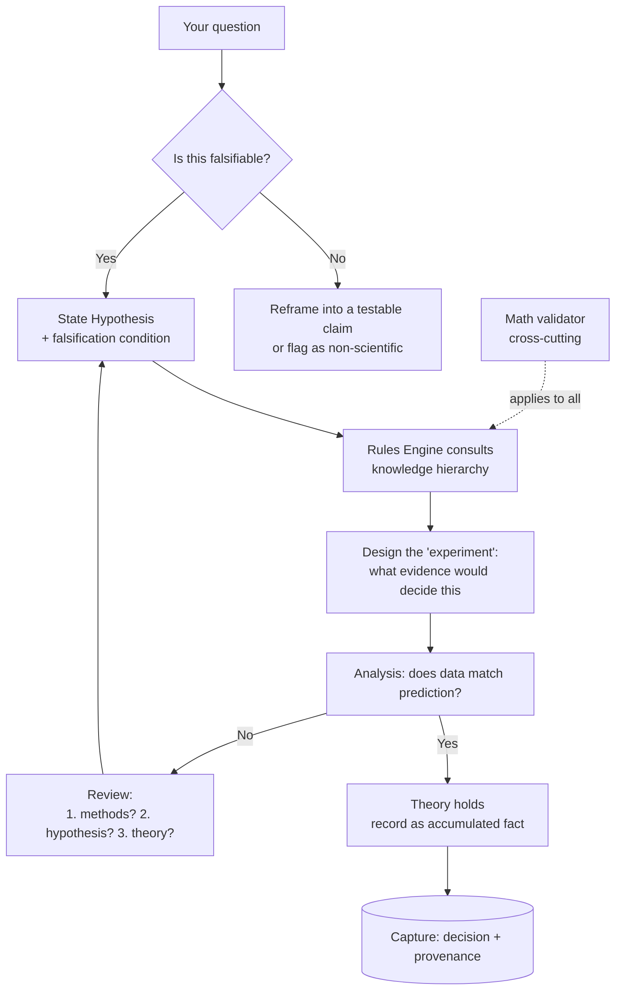
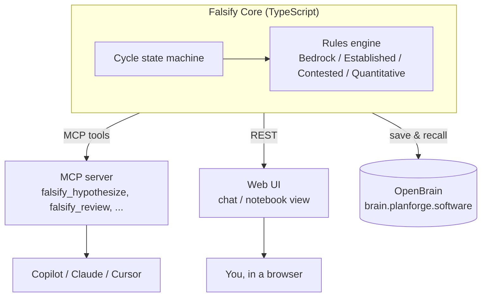

# Falsify

> A reasoning tool that refuses to just hand you an answer. It runs your scientific
> questions through the **Cycle of Scientific Enterprise** and returns *falsifiable
> hypotheses with their test conditions* — not opinions, not consensus, not "the
> science is settled."

**Status:** Design draft — iterate freely. Nothing here is final.
**Last updated:** 2026-06-15

---

## 1. The Thesis (why this exists)

Most AI tools give you a *conclusion*. Falsify gives you the *loop that produces
knowledge*. It is built on two sources:

1. **The Cycle of Scientific Enterprise** (Bright Minds Learning) — science is a
   *loop, not a line*. The most important move is the **"No" branch**: when data
   disagrees with a prediction, you don't massage the data — you ask, in order:
   *Did I run the experiment well? Was my hypothesis well-formed? Is the theory
   itself wrong?*
2. **Plan Forge's Forge-Master + Memory Architecture** — a read-only reasoning
   orchestrator that classifies intent, pulls layered memory, surfaces *dissent*
   between models instead of picking a winner, and records provenance.

The guiding line, from Feynman: **"The first principle is that you must not fool
yourself — and you are the easiest person to fool."**

### Design commitments (non-negotiable)

- **Never return a bare conclusion.** Always return a *hypothesis + falsification
  condition*: "If this is true, you'd expect to observe X; here's what would prove
  it wrong."
- **Force the No/Review loop.** No "Yes" is accepted until the three Review
  questions are asked, in order.
- **A-political by construction.** The method is indifferent to authority, peer
  group, and what's fashionable. It asks one question over and over: *does the data
  agree with the prediction?*
- **Demand the receipts, don't reflex-reject.** We distinguish the *institutional
  consensus around a finding* from the *methodological grounds for it*. Consensus
  is **down-weighted, not banned** (see §4, Weighting).
- **Math is mandatory, not optional.** Base rates, priors, and probability are
  applied to every claim — you can't skip them to drive a narrative.

---

## 2. Two Subsystems, Kept Separate

These must not be conflated or they fight each other:

| Axis | What it is | Subsystem |
|---|---|---|
| **Process** | *How* the agent reasons | The Cycle (state machine), §3 |
| **Knowledge hierarchy** | *What* the agent may lean on, and how hard | Rules Engine (tiers), §4 |

The Cycle decides the *moves*. The Rules Engine decides *what evidence is in play
and at what weight*. The Math tier (§4) is a **cross-cutting validator** applied to
all of it.

---

## 3. The Cycle (process / state machine)

Faithful to the four-bubble inner loop + the amber falsification loop.



### Cycle states

| State | Agent's job | Output contract |
|---|---|---|
| **Intake** | Is the question falsifiable? If not, reframe or flag as outside the method (Popper's line). | `{ falsifiable: bool, reframed_claim? }` |
| **Hypothesis** | Produce an informed, testable prediction grounded in current theory. | `{ statement, predicts: X, falsified_if: Y }` |
| **Experiment** | Define what *evidence/observation* would decide it — designed so it *could* fail. | `{ decisive_evidence[], could_fail: true }` |
| **Analysis** | Compare actual data to the prediction. Yes or No. | `{ verdict: yes|no, evidence_cited[] }` |
| **Review (No)** | Ask the three questions **in order**. Loop back to Hypothesis. | `{ q1_methods, q2_hypothesis, q3_theory }` |
| **Theory (Yes)** | Theory survives a test → record a new accumulated fact + provenance. | `{ fact, provenance, survived_test }` |

### Hard behaviors

- On detecting a **consensus appeal** ("the science is settled", "experts agree"),
  the agent responds with the essay's challenge: *"Which experiment showed that,
  and could it have come out the other way?"*
- The **Review branch is mandatory** before any Yes is finalized — surface the
  three questions even when the answer is Yes (cheap insurance against fooling
  ourselves).

---

## 4. Rules Engine (knowledge hierarchy)

> ⚠️ **Naming note:** Plan Forge already uses L1/L2/L3 for its *memory* tiers. To
> avoid collision, the **knowledge tiers use names, not L-numbers.** "L1–L4" from
> the original brief map to the named tiers below.

| Tier | Original name | What it holds | Default weight | Override rule |
|---|---|---|---|---|
| **Bedrock** | L1 | Established scientific laws & observed/natural laws (physics, thermodynamics, conservation laws). | **Highest** | Cannot be overridden by a lower tier. |
| **Established** | L2 | Well-supported theory, not yet "law," largely undisputed (e.g. much of relativity). | **High** | Can be challenged only with decisive contrary evidence. |
| **Contested** | L3 | Best explanation at present; *multiple legitimate sides* (e.g. competing origins models). | **Medium, split** | Present **all** sides, each with falsifiability status. Never pick a winner. |
| **Quantitative** | L4 | Math, statistics, probability, base rates. | **Cross-cutting** | **Always applied** to every tier; can't be skipped. |

### How tiers behave

- **Bedrock** claims are presented with high certainty and cite the law.
- **Established** claims note "strongly supported, falsifiable, currently
  unrefuted."
- **Contested** claims are the careful part. The agent must:
  - present each competing explanation,
  - attach each one's **falsifiability status** (what observation would kill it),
  - **flag any claim that no conceivable observation could falsify** as *outside
    the scientific method* (Popper) — regardless of which "side" it favors.
- **Quantitative** is a *lens*, not a shelf. Every claim from any tier is run
  through base-rate / probability checks before it's reported.

### Weighting — where consensus lives

Consensus is **a signal, not a verdict.** It enters the score at **low weight** and
*never* on its own:

```
claim_score =
      w_bedrock      * bedrock_support
    + w_established  * established_support
    + w_evidence     * direct_experimental_evidence
    + w_falsifiable  * falsifiability_quality      // higher if it CAN be tested
    + w_math         * statistical_support
    + w_consensus    * institutional_consensus     // LOW weight, never decisive
```

- `w_consensus` is the **smallest** weight in the stack and **cannot move a verdict
  by itself.** It can only break ties between otherwise-equal, equally-falsifiable
  explanations.
- `w_falsifiability_quality` *rewards* claims that expose themselves to refutation
  and *penalizes* unfalsifiable ones.
- Exact weights are tunable config (see §7). The **ordering** is the commitment;
  the numbers are knobs.

> **Why down-weight, not ban:** rejecting consensus reflexively is itself a bias.
> The honest move is to demand the receipts — *which experiment, and could it have
> failed?* — not to assume the consensus is wrong.

### Knowledge storage — two stores, one truth

The tiered knowledge is stored with a **truth-in-git / index-in-the-brain** split
(mirroring Plan Forge's own L2-files / L3-OpenBrain pattern):

| Role | Where | Why |
|---|---|---|
| **Source of truth** | `knowledge/*.yaml` in this repo — one file per tier (`bedrock`, `established`, `contested`, `quantitative`, `refuted`). | Diff-able, PR-reviewable, never drifts. The git history *is* a falsification audit trail of what we admit to each tier and why. |
| **Semantic index** | OpenBrain (`project: "falsify"`, tier folded into content). | Fast fuzzy recall during the cycle; also accumulates new survived-test facts. |

- A **seed-sync step** reads the YAML and pushes each entry into OpenBrain (via the
  `capture_thought` MCP tool) as a memory whose structured metadata
  (`tier, falsifiable, falsified_if, source_id, …`) is folded into the searchable
  content. The YAML is canonical; OpenBrain is a searchable copy, never hand-edited.
- **Why not store the laws only in OpenBrain?** A vector store is mutable and
  returns approximate matches — wrong for an *authoritative* Bedrock tier. Bedrock
  must be exact and auditable, so it lives in version control.

#### Seed entry schema (per tier)

- **Bedrock / Established:** `{ id, statement, domain, type, falsifiable,
  falsified_if, status, confidence, domain_of_validity?, sources[] }`.
- **Contested:** `{ id, question, domain, positions[] }` where each position is
  `{ label, claim, falsifiable, falsified_if, falsifiability_status, ... }` plus an
  `engine_directive` that forbids picking a winner.
- **Quantitative:** `{ id, principle, statement, formula?, triggers[],
  failure_guarded }` — a cross-cutting lens, not a fact.

#### Honesty rules baked into the seed

- Where a "law" is really a domain-limited approximation, the entry says so in
  `domain_of_validity` — we never inflate certainty.
- Contested entries carry **every** position with its falsifiability status; any
  position whose central claim admits no conceivable falsifier is flagged
  *outside the scientific method* (Popper), applied **symmetrically** to all sides.
- The starter set is intentionally small and curated; it grows by pull request.

---

## 5. Memory (lab notebook + accumulated facts)

Modeled on Plan Forge's three-tier capture, renamed to stay distinct from the
knowledge tiers:

| Memory tier | Lifetime | Holds | Backend | Notebook analogy |
|---|---|---|---|---|
| **Working** | Current inquiry/session | Live hypotheses, dead ends, the current loop. | In-process (RAM) | Scratch pad |
| **Notebook** | Durable / per-project | Decisions, gotchas, **mistakes kept visible** (single-line cross-out, dated — straight from the essay). | Local `.falsify/*.jsonl` | The bound lab notebook |
| **Corpus** | Cross-session / semantic | Facts that *survived their tests*, searchable. | **OpenBrain** (Postgres + pgvector) | The accumulated pile of facts |

### Corpus backend — OpenBrain

The Corpus tier is backed by the **already-running OpenBrain instance** at
`https://brain.planforge.software` (health-checked live: `{"status":"healthy",
"service":"open-brain-mcp"}`).

> **Transport reality (verified live).** OpenBrain runs *two* listeners: a REST
> API (`POST /memories`, with a structured `metadata` field) on an internal port,
> and an **MCP-over-SSE** server on the public 443 port. The custom domain
> `brain.planforge.software` only fronts the **MCP** listener — the REST port is
> not publicly reachable (it times out). So Falsify writes to the hosted brain
> **via MCP**, not REST. The `/health` path is the only REST-style path the public
> host answers; everything else returns 404. See
> [`src/memory/openbrainMcpClient.ts`](src/memory/openbrainMcpClient.ts).

- **Connect:** open an SSE session to `GET /sse` with the `x-brain-key` header,
  receive a `sessionId`, then issue JSON-RPC `tools/call` requests to
  `POST /messages?sessionId=…`.
- **Save:** call the **`capture_thought`** tool with `{ content, project:
  "falsify", source }`. The tool accepts only those fields (no `metadata`), so
  Falsify **folds its structured metadata into the `content` text** as a readable
  `— Falsify knowledge seed —` block; the embedder still indexes it for recall.
- **Recall:** call the **`search_thoughts`** tool with `{ query, project:
  "falsify", limit }` → returns records ranked by cosine similarity.
- **Rate limiting:** the public host (Cloudflare) throttles rapid sequential
  `POST /messages` calls with HTTP 429. The client throttles (≈400 ms between
  captures) and retries transient 429/5xx with exponential backoff.
- **Scope:** everything Falsify writes uses `project: "falsify"` so it never mixes
  with other tenants of the brain.
- **Auth:** reuses the **existing `OPENBRAIN_KEY` environment variable** already set
  on the dev machine (64-char hex, User scope) — the same key Plan Forge uses. The
  secret is **never committed**; Falsify reads it from `process.env` at runtime and
  sends it only in the `x-brain-key` header — never in a URL, error, log, or queue
  file.
- **Endpoints (both authorized by the same key):**
  - Public MCP-SSE: `https://brain.planforge.software/sse` (portable; used by
    deployed Falsify and the seed-sync tool).
  - Private MCP-SSE: `https://openbrain.tailfb4202.ts.net/sse` (from `OPENBRAIN_URL`;
    Tailscale-only, used for local dev).
- **Offline fallback:** any save that can't reach the brain is written to an
  on-disk FIFO queue (`.falsify/queue/`) and replayed on the next successful save
  ([`src/memory/offlineQueue.ts`](src/memory/offlineQueue.ts)).
- **Falsify-specific metadata (folded into content):** every Corpus record carries
  `{ tier: bedrock|established|contested|quantitative|refuted, falsifiable,
  falsified_if, … }` so a recalled fact never re-enters at a higher certainty than
  it earned.
- **Graceful degradation:** if the brain is unreachable, writes buffer to a local
  queue (`.falsify/brain-queue.jsonl`) and drain later — a network blip never loses a
  memory or blocks the cycle. (Pattern borrowed from Plan Forge's Anvil/DLQ doorway.)

### Memory commitments

- **Mistakes stay in the notebook.** A wrong hypothesis is never deleted — it's
  struck through, dated, and kept legible. That's the falsification loop made
  visible.
- Every capture carries **provenance + the tier it came from + falsifiability
  status**, so nothing drifts into a higher certainty than it earned.
- Best-effort fan-out: a failure in one tier never blocks the others.

---

## 6. Dissent over consensus (multi-model)

Borrowed from Forge-Master's **Quorum Advisory Mode**: for Contested-tier questions,
fan the prompt to multiple models *in parallel*, then **extract the disagreement**
and present competing hypotheses with their evidence. **No auto-winner.** The human
picks — because the whole point is to surface disagreement, not bury it.

---

## 7. Open Design Questions (to iterate)

- [ ] **Weights:** starting values for `w_*` in §4. Ordering is fixed; numbers TBD.
- [ ] **"Evidence" sourcing:** how does the agent obtain *data* (papers, datasets,
      user-supplied observations)? Retrieval strategy + provenance.
- [ ] **Falsifiability classifier:** how do we reliably detect an unfalsifiable
      claim? (Heuristics + model judgment + a checklist.)
- [ ] **Consensus detection:** how to detect a "settled science" appeal in a
      question or a source, and trigger the challenge response.
- [x] **Tech stack:** ~~UI, providers, local vs hosted, rules-engine impl.~~
      **Decided** — Node + TypeScript, MCP-core + web UI, OpenBrain backend, built
      with Plan Forge. See §9.
- [x] **Brain auth:** ~~confirm key requirement.~~ **Resolved** — reuse existing
      `OPENBRAIN_KEY` env var (64-char hex, User scope); never committed. Same key
      works for both the public and Tailscale endpoints.
- [x] **Seed-sync tool:** `src/knowledge/seedSync.ts` + CLI (`npm run seed-sync`,
      `--dry-run` supported) pushes `knowledge/*.yaml` into OpenBrain
      (`project: "falsify"`) with `{ tier, source_id, falsifiable, falsified_if }`
      plus tier-appropriate extras folded into the searchable content. Pure
      `buildSeedMemories` is unit-tested offline; transport failures queue locally,
      never throw. **Live-verified:** 51/51 memories seeded to the hosted brain over
      MCP (exactly 51 thoughts confirmed via `thought_stats`).
- [x] **Brain transport:** ~~REST `POST /memories`.~~ **Corrected** — the public host
      only exposes OpenBrain's **MCP-SSE** transport, so seeding goes through the
      `capture_thought` tool ([`src/memory/openbrainMcpClient.ts`](src/memory/openbrainMcpClient.ts))
      with throttle + 429/5xx backoff. The REST client
      ([`src/memory/openbrainClient.ts`](src/memory/openbrainClient.ts)) is retained
      for a local/devbox brain that exposes the REST port.
- [x] **Knowledge expansion:** corpus grown 19 → 51 entries across 5 tiers
      (added the refuted/graveyard tier). Continue growing via PR.
- [ ] **Tier tagging:** manual curation vs. model-assisted classification of which
      tier a claim belongs to.
- [ ] **Output format:** the exact "hypothesis + falsification condition" card the
      user sees.

---

## 8. Naming & Identity

- **Name:** Falsify — the app's whole job is trying to prove claims wrong.
- **Tagline candidates:**
  - "Follow the data, not the conclusion."
  - "Which experiment showed that — and could it have come out the other way?"
  - "A reasoning tool that takes the No branch."

---

## 9. Stack & Architecture Decisions

> Status: **decided** (2026-06-15). Numbers/details may still be tuned.

### Decision 1 — Language: **Node + TypeScript**

Chosen over .NET because the surrounding ecosystem is Node/ESM:
- OpenBrain (the memory backend) is Node/TS (Hono + MCP SDK).
- Plan Forge (used to build this) is Node/ESM.
- The MCP SDK (`@modelcontextprotocol/sdk`) is first-class in Node and natively
  consumed by Copilot / Claude / Cursor.

Picking .NET would mean re-implementing MCP plumbing and memory clients that already
exist in TypeScript. Single stack = less impedance.

### Decision 2 — Shape: **MCP-core first, Web UI second (build both)**

The cycle state machine + rules engine are the reusable core. They are exposed
through **two transports**, mirroring OpenBrain's REST + MCP dual surface:



- **Phase A — MCP server.** Ship the core as an MCP server so Falsify's discipline is
  usable *inside Copilot* immediately, no UI required. Candidate tools:
  `falsify_intake` (falsifiable?), `falsify_hypothesize`, `falsify_experiment`,
  `falsify_analyze`, `falsify_review` (the No branch), `falsify_recall`.
- **Phase B — Web UI.** A thin chat/notebook front-end that is *just another consumer*
  of the same core. Surfaces the hypothesis-card output and the visible-mistakes
  notebook.
- The core never imports a transport, so neither MCP nor HTTP locks us in.

### Decision 3 — Memory backend: **OpenBrain (live, hosted)**

Use `https://brain.planforge.software` as the Corpus tier (see §5). Local files for
the Notebook tier; RAM for Working. **Auth reuses the existing `OPENBRAIN_KEY`
env var** — secret never committed (see §5 → Corpus backend).

### Decision 4 — Build with **Plan Forge**

Plan, harden, and execute Falsify using the Plan Forge shop you already run.

---

## 10. Build Plan (using Plan Forge)

High-level sequence — refined once we start:

1. **Onboard the repo.** From the Plan Forge checkout:
   `./setup.ps1 -Preset typescript -ProjectPath "E:\GitHub\Falsify" -ProjectName "Falsify"`.
   Produces `.forge.json`, `.github/copilot-instructions.md`, `AGENTS.md`, and a
   roadmap stub.
2. **Smelt the idea (Crucible).** Run a Crucible interview (`full` mode) to turn this
   DESIGN.md into a hardened plan with a Scope Contract, execution slices, and
   validation gates.
3. **Harden + execute slices.** Likely first slices:
   - Slice 1 — Core types + the Cycle state machine (no transport).
   - Slice 2 — Rules engine (four tiers + the cross-cutting math validator + the
     weighted `claim_score`).
   - Slice 3 — OpenBrain client (save/recall + local queue fallback).
   - Slice 4 — MCP server exposing the `falsify_*` tools.
   - Slice 5 — Web UI (hypothesis card + notebook view).
4. **Wire OpenBrain federation.** Point `.forge.json` memory at
   `brain.planforge.software`, `project: "falsify"`.

---

## 11. Glossary

- **Cycle of Scientific Enterprise** — the loop (Theory → Hypothesis → Experiment →
  Analysis → Yes/No → Review) this tool enforces.
- **No branch** — the falsification path; the most important move in the cycle.
- **Falsifiability** — Popper's criterion: a claim is scientific only if some
  conceivable observation could prove it false.
- **Knowledge tiers** — Bedrock / Established / Contested / Quantitative (the
  rules-engine hierarchy).
- **Memory tiers** — Working / Notebook / Corpus (what the tool remembers).
