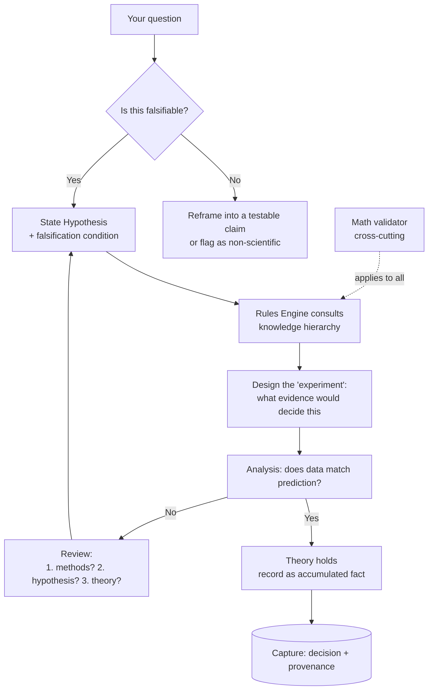

# Falsify

> A reasoning tool that refuses to just hand you an answer. It runs your scientific
> questions through the **Cycle of Scientific Enterprise** and returns *falsifiable
> hypotheses with their test conditions* — not opinions, not consensus, not "the
> science is settled."

**Status:** Design draft — iterate freely. Nothing here is final.
**Last updated:** 2026-06-15

---

## 1. The Thesis (why this exists)

Most AI tools give you a *conclusion*. Falsify gives you the *loop that produces
knowledge*. It is built on two sources:

1. **The Cycle of Scientific Enterprise** (Bright Minds Learning) — science is a
   *loop, not a line*. The most important move is the **"No" branch**: when data
   disagrees with a prediction, you don't massage the data — you ask, in order:
   *Did I run the experiment well? Was my hypothesis well-formed? Is the theory
   itself wrong?*
2. **Plan Forge's Forge-Master + Memory Architecture** — a read-only reasoning
   orchestrator that classifies intent, pulls layered memory, surfaces *dissent*
   between models instead of picking a winner, and records provenance.

The guiding line, from Feynman: **"The first principle is that you must not fool
yourself — and you are the easiest person to fool."**

### Design commitments (non-negotiable)

- **Never return a bare conclusion.** Always return a *hypothesis + falsification
  condition*: "If this is true, you'd expect to observe X; here's what would prove
  it wrong."
- **Force the No/Review loop.** No "Yes" is accepted until the three Review
  questions are asked, in order.
- **A-political by construction.** The method is indifferent to authority, peer
  group, and what's fashionable. It asks one question over and over: *does the data
  agree with the prediction?*
- **Demand the receipts, don't reflex-reject.** We distinguish the *institutional
  consensus around a finding* from the *methodological grounds for it*. Consensus
  is **down-weighted, not banned** (see §4, Weighting).
- **Math is mandatory, not optional.** Base rates, priors, and probability are
  applied to every claim — you can't skip them to drive a narrative.

---

## 2. Two Subsystems, Kept Separate

These must not be conflated or they fight each other:

| Axis | What it is | Subsystem |
|---|---|---|
| **Process** | *How* the agent reasons | The Cycle (state machine), §3 |
| **Knowledge hierarchy** | *What* the agent may lean on, and how hard | Rules Engine (tiers), §4 |

The Cycle decides the *moves*. The Rules Engine decides *what evidence is in play
and at what weight*. The Math tier (§4) is a **cross-cutting validator** applied to
all of it.

---

## 3. The Cycle (process / state machine)

Faithful to the four-bubble inner loop + the amber falsification loop.



### Cycle states

| State | Agent's job | Output contract |
|---|---|---|
| **Intake** | Is the question falsifiable? If not, reframe or flag as outside the method (Popper's line). | `{ falsifiable: bool, reframed_claim? }` |
| **Hypothesis** | Produce an informed, testable prediction grounded in current theory. | `{ statement, predicts: X, falsified_if: Y }` |
| **Experiment** | Define what *evidence/observation* would decide it — designed so it *could* fail. | `{ decisive_evidence[], could_fail: true }` |
| **Analysis** | Compare actual data to the prediction. Yes or No. | `{ verdict: yes|no, evidence_cited[] }` |
| **Review (No)** | Ask the three questions **in order**. Loop back to Hypothesis. | `{ q1_methods, q2_hypothesis, q3_theory }` |
| **Theory (Yes)** | Theory survives a test → record a new accumulated fact + provenance. | `{ fact, provenance, survived_test }` |

### Hard behaviors

- On detecting a **consensus appeal** ("the science is settled", "experts agree"),
  the agent responds with the essay's challenge: *"Which experiment showed that,
  and could it have come out the other way?"*
- The **Review branch is mandatory** before any Yes is finalized — surface the
  three questions even when the answer is Yes (cheap insurance against fooling
  ourselves).

---

## 4. Rules Engine (knowledge hierarchy)

> ⚠️ **Naming note:** Plan Forge already uses L1/L2/L3 for its *memory* tiers. To
> avoid collision, the **knowledge tiers use names, not L-numbers.** "L1–L4" from
> the original brief map to the named tiers below.

| Tier | Original name | What it holds | Default weight | Override rule |
|---|---|---|---|---|
| **Bedrock** | L1 | Established scientific laws & observed/natural laws (physics, thermodynamics, conservation laws). | **Highest** | Cannot be overridden by a lower tier. |
| **Established** | L2 | Well-supported theory, not yet "law," largely undisputed (e.g. much of relativity). | **High** | Can be challenged only with decisive contrary evidence. |
| **Contested** | L3 | Best explanation at present; *multiple legitimate sides* (e.g. competing origins models). | **Medium, split** | Present **all** sides, each with falsifiability status. Never pick a winner. |
| **Quantitative** | L4 | Math, statistics, probability, base rates. | **Cross-cutting** | **Always applied** to every tier; can't be skipped. |

### How tiers behave

- **Bedrock** claims are presented with high certainty and cite the law.
- **Established** claims note "strongly supported, falsifiable, currently
  unrefuted."
- **Contested** claims are the careful part. The agent must:
  - present each competing explanation,
  - attach each one's **falsifiability status** (what observation would kill it),
  - **flag any claim that no conceivable observation could falsify** as *outside
    the scientific method* (Popper) — regardless of which "side" it favors.
- **Quantitative** is a *lens*, not a shelf. Every claim from any tier is run
  through base-rate / probability checks before it's reported.

### Weighting — where consensus lives

Consensus is **a signal, not a verdict.** It enters the score at **low weight** and
*never* on its own:

```
claim_score =
      w_bedrock      * bedrock_support
    + w_established  * established_support
    + w_evidence     * direct_experimental_evidence
    + w_falsifiable  * falsifiability_quality      // higher if it CAN be tested
    + w_math         * statistical_support
    + w_consensus    * institutional_consensus     // LOW weight, never decisive
```

- `w_consensus` is the **smallest** weight in the stack and **cannot move a verdict
  by itself.** It can only break ties between otherwise-equal, equally-falsifiable
  explanations.
- `w_falsifiability_quality` *rewards* claims that expose themselves to refutation
  and *penalizes* unfalsifiable ones.
- Exact weights are tunable config (see §7). The **ordering** is the commitment;
  the numbers are knobs.

> **Why down-weight, not ban:** rejecting consensus reflexively is itself a bias.
> The honest move is to demand the receipts — *which experiment, and could it have
> failed?* — not to assume the consensus is wrong.

---

## 5. Memory (lab notebook + accumulated facts)

Modeled on Plan Forge's three-tier capture, renamed to stay distinct from the
knowledge tiers:

| Memory tier | Lifetime | Holds | Notebook analogy |
|---|---|---|---|
| **Working** | Current inquiry/session | Live hypotheses, dead ends, the current loop. | Scratch pad |
| **Notebook** | Durable / per-project | Decisions, gotchas, **mistakes kept visible** (single-line cross-out, dated — straight from the essay). | The bound lab notebook |
| **Corpus** | Cross-session / semantic | Facts that *survived their tests*, searchable. | The accumulated pile of facts |

### Memory commitments

- **Mistakes stay in the notebook.** A wrong hypothesis is never deleted — it's
  struck through, dated, and kept legible. That's the falsification loop made
  visible.
- Every capture carries **provenance + the tier it came from + falsifiability
  status**, so nothing drifts into a higher certainty than it earned.
- Best-effort fan-out: a failure in one tier never blocks the others.

---

## 6. Dissent over consensus (multi-model)

Borrowed from Forge-Master's **Quorum Advisory Mode**: for Contested-tier questions,
fan the prompt to multiple models *in parallel*, then **extract the disagreement**
and present competing hypotheses with their evidence. **No auto-winner.** The human
picks — because the whole point is to surface disagreement, not bury it.

---

## 7. Open Design Questions (to iterate)

- [ ] **Weights:** starting values for `w_*` in §4. Ordering is fixed; numbers TBD.
- [ ] **"Evidence" sourcing:** how does the agent obtain *data* (papers, datasets,
      user-supplied observations)? Retrieval strategy + provenance.
- [ ] **Falsifiability classifier:** how do we reliably detect an unfalsifiable
      claim? (Heuristics + model judgment + a checklist.)
- [ ] **Consensus detection:** how to detect a "settled science" appeal in a
      question or a source, and trigger the challenge response.
- [ ] **Tech stack:** UI (chat? notebook?), model providers, local vs. hosted,
      rules-engine implementation (declarative config vs. code).
- [ ] **Tier tagging:** manual curation vs. model-assisted classification of which
      tier a claim belongs to.
- [ ] **Output format:** the exact "hypothesis + falsification condition" card the
      user sees.

---

## 8. Naming & Identity

- **Name:** Falsify — the app's whole job is trying to prove claims wrong.
- **Tagline candidates:**
  - "Follow the data, not the conclusion."
  - "Which experiment showed that — and could it have come out the other way?"
  - "A reasoning tool that takes the No branch."

---

## 9. Glossary

- **Cycle of Scientific Enterprise** — the loop (Theory → Hypothesis → Experiment →
  Analysis → Yes/No → Review) this tool enforces.
- **No branch** — the falsification path; the most important move in the cycle.
- **Falsifiability** — Popper's criterion: a claim is scientific only if some
  conceivable observation could prove it false.
- **Knowledge tiers** — Bedrock / Established / Contested / Quantitative (the
  rules-engine hierarchy).
- **Memory tiers** — Working / Notebook / Corpus (what the tool remembers).
